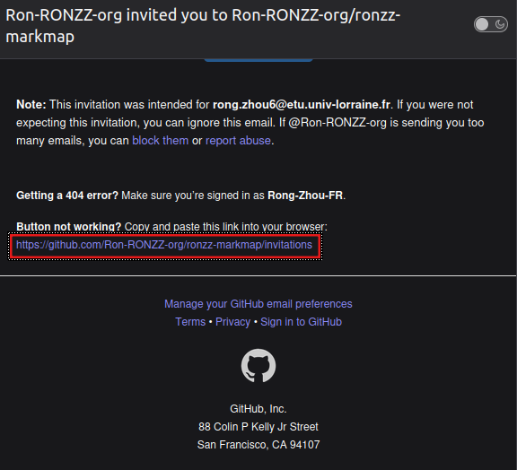
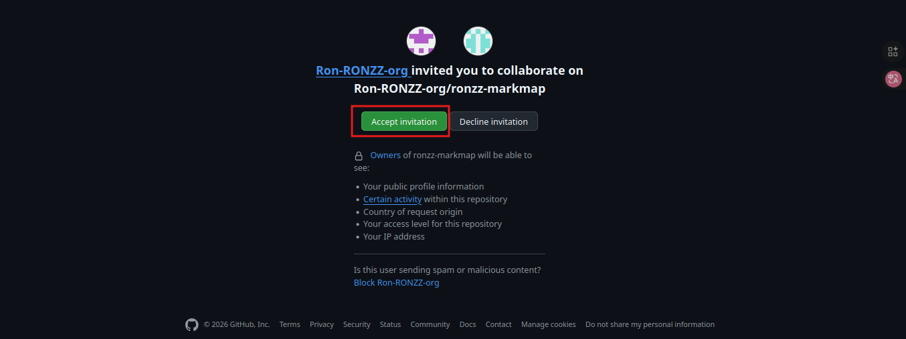

# Guide sur l'édition du site web d'Union Locale CGT Épinal

## Présentation de notre site web

### Noms de domaine

Le domaine principal de notre site web est [ul.cgt‑epinal.fr](https://ul.cgt-epinal.fr/) 

[cgt-epinal.fr/](https://cgt-epinal.fr/) et [www.cgt-epinal.fr/](https://www.cgt-epinal.fr/) sont des alias qui rédige vers le domain pricipal.

### Hébergement

Notre site web est [hébégé sur Github](https://github.com/Ron-RONZZ-org/CGT-epinal) comme siteweb statique via `Github Pages`. Ce disposition, utilisé par des millions des professionelles d'informatique autours du monde, nous permet de rendre notre site web rapide, secure, et accessible gratuiement.

## Accès administratif 

Comme attendu, pour la sécurité de notre site web, il vous faut être authentifié-e pour effectuer des modifications. Voici la procédure d'accès pour la première fois :

### Se connecter sur github

> Malheureusement l'interface du github est actuellement uniquement en anglais. Vous trouvez peut-être un traducteur web comme [Google traduction](https://translate.google.fr/?hl=fr&sl=en&tl=fr&op=websites) utile.

Il vous faut un compte github pour ajouter/modifier contenu du site. Si vous n'avez pas encore un compte github, vous pouvez [créer un compte ici](https://github.com/signup)

Si vous avez besoin plus d'aide, consulter [ce guide](https://docs.github.com/en/get-started/start-your-journey/creating-an-account-on-github).

### Demande d'accès administrative

Dès que vous vous êtes connecté sur github, copier votre nom d'utilisateur :

Et envoyer une demande d'accès depuis **votre mail habituel** à `tech@cgt-epinal.fr` avec votre nom d'utilisateur indiqué.

Vous allez reçevoir un mail d'invitation de la part de Github dès votre demande est traité, avec le titre `Ron-RONZZ-org invited you to Ron-RONZZ-org/CGT-epinal`.

### Activation d'accès administratif

Vous trouvez un lien d'activation vers la fin du mail d'invitation :

Accéder ce lien et accepter l'invitation :

Fécilitations : vous êtes maintenant administrateur/euse de notre site web et vous pouvez commencer de publier/modifier des contenus !

Pour tous les éditions suivants, vous n'avez besoin que de vous vous connecter avec votre compte github.

## Édition 

### Une note brève sur `Git`

Notre site web est construire avec `Git`, un logiciel libre développé par la communauté Linux sous la direction de Linus Tolvards dans les années 1990. Aujourd'hui, c'est le standard global pour les projets informatiques de grade professionnelle. Ceci permet de la collaboration simultanée des centaines des contributeurs sur le même projet, même s'ils sont localisés geographiquement autour du monde et s'il ne se connaissent pas, de manière securisée et sans interférence mutuelle. Grâce au Git, il est aussi très facile de revenir à une version précédente en cas d'erreur majeure. 

Si vous êtes intéressé d'en savoir plus, [commencez par ici](https://midiverse.org/markmaps/rongzhou/git-1/fullscreen). Sinon vous avez toutes les connaissance que vous avez besoin de `Git` pour contribuer à notre site web.

### Espace d'édition

Comme notre site web est tout simplement un dépôt `Git`, vous pouvez l'éditer depuis n'importe quel logiciel de programmation comme vous le souhaitez.

Si vous n'avez pas d'expérience précédent avec `Git`, l'option la plus simple est d'utiliser la version web de Visual Studio Code.

#### Utiliser la version web de Visual Studio Code

Accéder l'espace d'édition de notre site web [par ici](https://vscode.dev/github/Ron-RONZZ-org/CGT-epinal?vscode-lang=fr-fr).

Vous serez demandé-e de vous connecter à nouveau via Github :

Utiliser [vos crédentiels Github](#se-connecter-sur-github) pour vous connecter. 

### Ajouter un événement

Ajouter un événement est l'édition la plus fréquentemment effectué. La procédure est simple :

D'aboard, ouvrir le projet web dans [l'espace d'édition](https://vscode.dev/github/Ron-RONZZ-org/CGT-epinal?vscode-lang=fr-fr)

<video controls src="graphics/event-tuto.webm" title="Title"></video>

Cliquez n'importe ou dans l'éditeur du fichier et pressez `Ctrl+Maj+E` pour ouvrir l'onglet d`'Explorateur`.

Naviguez-vous vers le dossier `./events` par y cliquer au-dessus :

Le fichier [`event-example.md`](https://github.com/Ron-RONZZ-org/CGT-epinal/blob/main/events/event-example.md) contient un exemple générique d'un événement.

Le fichier [`event-template.md`](https://github.com/Ron-RONZZ-org/CGT-epinal/blob/main/events/event-example.md) contient un modèle vide d'un événement.

Pour créer un exemple, créer un nouveau fichier d'événements par cliquer au-dessus le bouton `+ fichier` et créer un nouveau fichier d'événement. Veuillez le donner un nom lisible comme `event-23-09-1895-juridique.md`. Notez le nom de ficher doit terminer avec l'extension `.md`, qui siginifie fichier text markdown. Puis ouvrir `event-template.md` par y cliquer au-dessus et selectionner tous les contenu par `CTRL+A` puis presser `CTRL+C` pour tout copier, puis revenir dans le ficher et presse `CTRL+V` pour coller tous.

Puis rempliez l'événement avec les contenu désiré. Veuillez noter qu'il ne faut **absolutement** pas changer les lignes qui commence avec `#` pour que l'événement sera affiché comme attendu. Aussi, pour la section `## Type`, il faut simplement cocher l'option besoin avec un `X` (lettere `x` en majuscule). Il ne sert à rien d'ajouter une nouvelle catégorie car elle ne sera pas prise en charge ! Si vous ne trouvez pas la catégorie d'événement besoin, contact `tech@cgt-epinal.fr`.

Pour savoir comment enregister et deployer vos éditions, c'est par ici.

### Enregister et deployer vos éditions

<video controls src="graphics/push.webm" title="Title"></video>

Cliquez n'importe ou dans l'éditeur du fichier et pressez `Ctrl+Maj+G` pour ouvrir l'onglet de `Contrôle de code source`.

Tapez un bref message pour expliquer les changements effectuer. Un message lisible rassure qu'on peut facilement revenir à une version précédente au cas d'erreur.

Puis pressez `CTRL+ENTRÉE` pour enregistrer les changements.

Attendez quelques minutes avant de vérifier que les changements sont bien effectuer sur [ul.cgt-epinal.fr](https://ul.cgt-epinal.fr).

