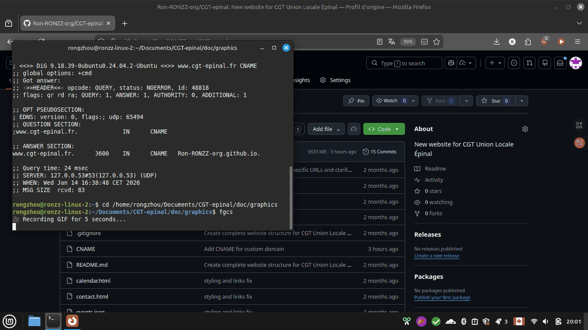
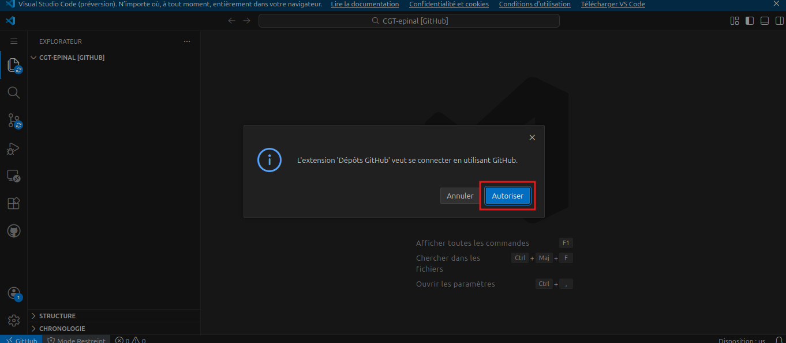
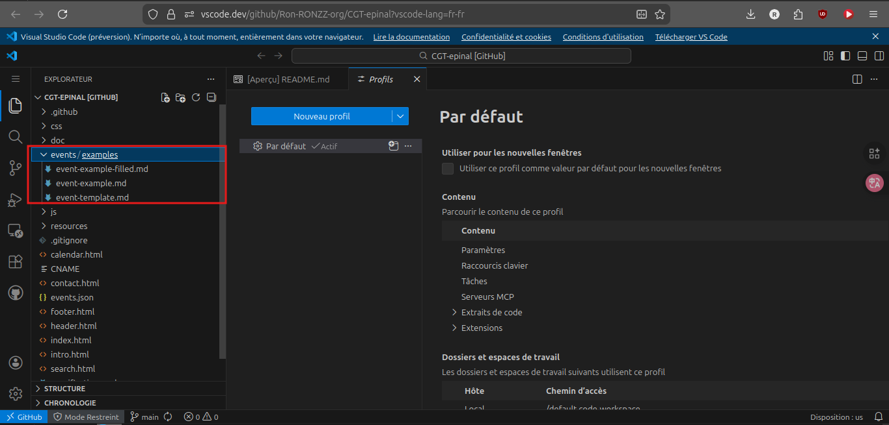

# Guide sur l'édition du site web de l'Union Locale CGT Épinal

## Présentation de notre site web

### Noms de domaine

Le domaine principal de notre site web est [ul.cgt-epinal.fr](https://ul.cgt-epinal.fr/)

### Hébergement

Notre site web est [hébergé sur Github](https://github.com/Ron-RONZZ-org/CGT-epinal) comme site web statique via `Github Pages`. Cette solution, utilisée par des millions de professionnels de l'informatique autour du monde, nous permet de rendre notre site web rapide, sécurisé et accessible gratuitement.

## Accès administratif

Comme attendu, pour la sécurité de notre site web, il vous faut être authentifié·e pour effectuer des modifications. Voici la procédure d'accès pour la première fois :

### Se connecter sur GitHub

> Malheureusement, l'interface de GitHub est actuellement uniquement en anglais. Vous trouverez peut-être un traducteur web comme [Google Traduction](https://translate.google.fr/?hl=fr&sl=en&tl=fr&op=websites) utile.

Il vous faut un compte GitHub pour ajouter ou modifier le contenu du site. Si vous n'avez pas encore de compte GitHub, vous pouvez [créer un compte ici](https://github.com/signup).

Si vous avez besoin de plus d'aide, consultez [ce guide](https://docs.github.com/en/get-started/start-your-journey/creating-an-account-on-github).

### Demande d'accès administratif

Dès que vous êtes connecté·e sur GitHub, copiez votre nom d'utilisateur :



Et envoyez une demande d'accès depuis **votre mail habituel** à `tech@cgt-epinal.fr` avec votre nom d'utilisateur indiqué.

Vous allez recevoir un mail d'invitation de la part de GitHub dès que votre demande sera traitée, avec le titre `Ron-RONZZ-org invited you to Ron-RONZZ-org/CGT-epinal`.

### Activation de l'accès administratif

Vous trouverez un lien d'activation vers la fin du mail d'invitation :


Accédez à ce lien et acceptez l'invitation :


Félicitations : vous êtes maintenant administrateur·rice de notre site web et vous pouvez commencer à publier et modifier des contenus !

Pour toutes les éditions suivantes, vous n'avez besoin que de vous connecter avec votre compte GitHub.

## Édition

### Une note brève sur `Git`

Notre site web est construit avec `Git`, un logiciel libre développé par la communauté Linux sous la direction de Linus Torvalds dans les années 1990. Aujourd'hui, c'est le standard mondial pour les projets informatiques de grade professionnel. Ceci permet la collaboration simultanée de centaines de contributeurs sur le même projet, même s'ils sont localisés géographiquement autour du monde et s'ils ne se connaissent pas, de manière sécurisée et sans interférence mutuelle. Grâce à Git, il est aussi très facile de revenir à une version précédente en cas d'erreur majeure.

Si vous êtes intéressé·e d'en savoir plus, [commencez par ici](https://midiverse.org/markmaps/rongzhou/git-1/fullscreen). Sinon, vous avez toutes les connaissances dont vous avez besoin sur `Git` pour contribuer à notre site web.

### Espace d'édition

Comme notre site web est tout simplement un dépôt `Git`, vous pouvez l'éditer depuis n'importe quel logiciel de programmation comme vous le souhaitez.

Si vous n'avez pas d'expérience préalable avec `Git`, l'option la plus simple est d'utiliser la version web de Visual Studio Code.

#### Utiliser la version web de Visual Studio Code

Accédez à l'espace d'édition de notre site web [par ici](https://vscode.dev/github/Ron-RONZZ-org/CGT-epinal?vscode-lang=fr-fr).

Vous serez invité·e à vous connecter à nouveau via GitHub :



Utilisez [vos identifiants GitHub](#se-connecter-sur-github) pour vous connecter.

### Ajouter un événement

Ajouter un événement est l'édition la plus fréquemment effectuée. La procédure est simple :

D'abord, ouvrez le projet web dans [l'espace d'édition](https://vscode.dev/github/Ron-RONZZ-org/CGT-epinal?vscode-lang=fr-fr).

Pour une démonstration vidéo, [cliquez ici](https://raw.githubusercontent.com/Ron-RONZZ-org/CGT-epinal/refs/heads/main/doc/graphics/event-tuto.webm)) 

Cliquez n'importe où dans l'éditeur du fichier et appuyez sur `Ctrl+Maj+E` pour ouvrir l'onglet `Explorateur`.

Naviguez vers le dossier `./events` en cliquant dessus :



Le fichier [`event-example.md`](https://github.com/Ron-RONZZ-org/CGT-epinal/blob/main/events/event-example.md) contient un exemple générique d'un événement.

Le fichier [`event-example-filled.md`](https://github.com/Ron-RONZZ-org/CGT-epinal/blob/main/events/event-example-filled.md) contient un exemple complet d'un événement en français.

Le fichier [`event-template.md`](https://github.com/Ron-RONZZ-org/CGT-epinal/blob/main/events/event-template.md) contient un modèle vide d'un événement.

Pour créer un événement, créez un nouveau fichier d'événement en cliquant sur le bouton `+ Fichier`. Veuillez lui donner un nom lisible comme `event-16-01-2026-juridique.md` (format : `event-DD-MM-YYYY-description.md`). Notez que le nom de fichier doit se terminer avec l'extension `.md`, qui signifie fichier texte Markdown. Puis ouvrez `event-template.md` en cliquant dessus et sélectionnez tout le contenu avec `Ctrl+A`, puis appuyez sur `Ctrl+C` pour tout copier, puis revenez dans votre nouveau fichier et appuyez sur `Ctrl+V` pour tout coller.

Puis remplissez l'événement avec le contenu désiré. Veuillez noter qu'il ne faut **absolument** pas changer les lignes qui commencent avec `##` pour que l'événement soit affiché comme attendu. Aussi, pour la section `## Type`, il faut simplement cocher l'option souhaitée avec un `X` (lettre `x` en majuscule). Il ne sert à rien d'ajouter une nouvelle catégorie car elle ne sera pas prise en charge ! Si vous ne trouvez pas la catégorie d'événement souhaitée, contactez `tech@cgt-epinal.fr`.

#### Formatage Markdown dans les descriptions

Les descriptions d'événements supportent le formatage Markdown pour rendre vos textes plus lisibles :

- **Texte en gras** : Entourez le texte avec `**texte**` ou `__texte__`
  - Exemple : `**Important**` s'affichera comme **Important**
  
- *Texte en italique* : Entourez le texte avec `*texte*` ou `_texte_`
  - Exemple : `*Note importante*` s'affichera comme *Note importante*

- Listes non-numérotées : Commencez chaque ligne avec `- ` ou `* `
  ```
  - Premier élément
  - Deuxième élément
  - Troisième élément
  ```

- Listes numérotées : Commencez chaque ligne avec `1. `, `2. `, etc.
  ```
  1. Première étape
  2. Deuxième étape
  3. Troisième étape
  ```

- Liens : Utilisez `[texte du lien](https://url.com)`
  - Exemple : `[Voir notre page Facebook](https://facebook.com/cgtepinal)`

- Images : Utilisez ``

#### Lien vers les réseaux sociaux

Si vous ajoutez un lien dans le titre de l'événement (première ligne), ce lien apparaîtra automatiquement en bas de la description avec le texte "Voir sur les réseaux sociaux".

Exemple :
```markdown
# [Permanence juridique](https://www.instagram.com/p/exemple)
```

#### Affichage sur le site

- **Page d'accueil** : Les 3 prochains événements à venir s'affichent avec un bouton `+` pour voir la description complète
- **Page Agenda** : Tous les événements à venir sont visibles avec la possibilité de filtrer par type
- **Événements passés** : Les événements dont la date est passée ne s'affichent plus automatiquement

Pour savoir comment enregistrer et déployer vos éditions, lisez la section suivante.

### Enregistrer et déployer vos éditions

Pour une démonstration vidéo, [cliquez ici]((https://raw.githubusercontent.com/Ron-RONZZ-org/CGT-epinal/refs/heads/main/doc/graphics/push.webm)) 

Cliquez n'importe où dans l'éditeur du fichier et appuyez sur `Ctrl+Maj+G` pour ouvrir l'onglet `Contrôle de code source`.

Tapez un bref message pour expliquer les changements effectués. Un message lisible assure qu'on peut facilement revenir à une version précédente en cas d'erreur.

Puis appuyez sur `Ctrl+Entrée` pour enregistrer les changements.

Attendez quelques minutes avant de vérifier que les changements sont bien effectués sur [ul.cgt-epinal.fr](https://ul.cgt-epinal.fr).


